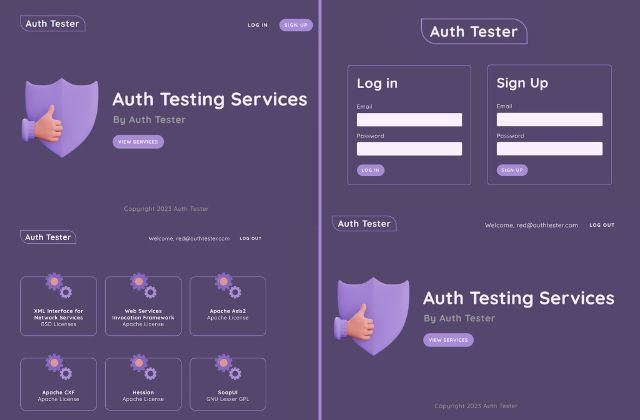
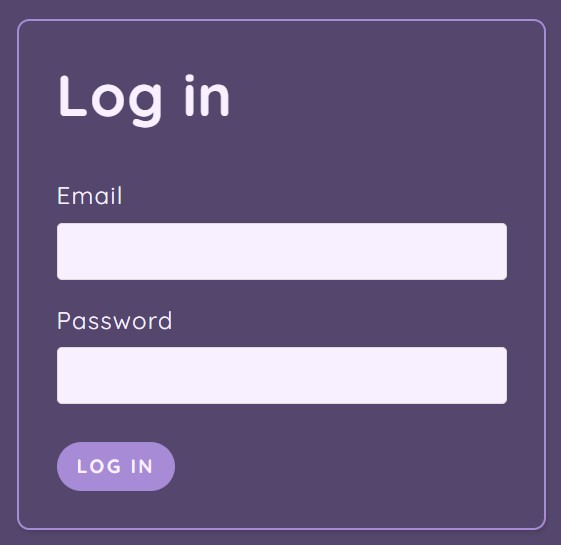
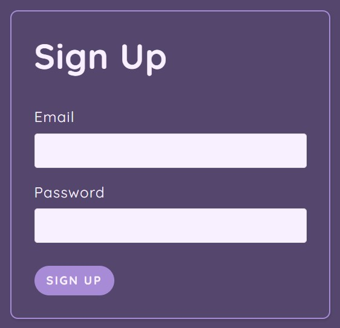
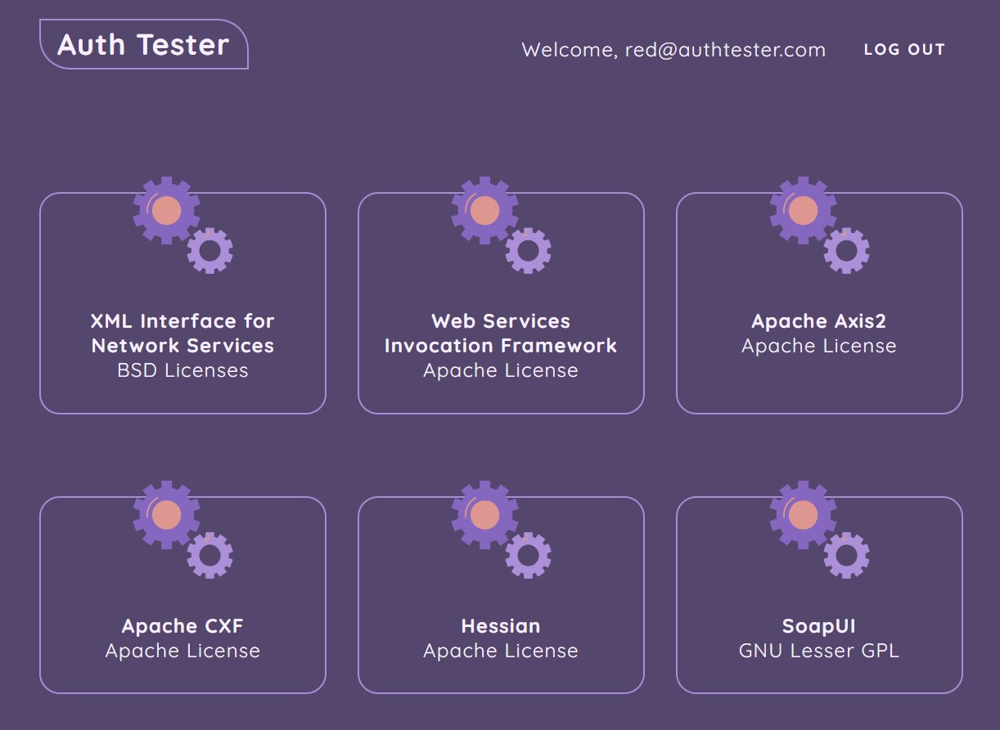

# Auth Tester

Auth Tester is a project setup for impleamenting MVC (Model View Control) model using - Node.js, Express.js, ejs (templating engine), and MongoDB.  

---
## Folder Structure -
- **public** (dir) - contains all the static files which can be accessible publically.
  - logo.PNG
  - services.PNG
  - styles.css
- **views** (dir) - contains all the views which are rendered when a specific request is made by the user.
  - partials (dir) - contains view files which are used in every view.
    - header.ejs
    - footer.ejs
  - home.ejs
  - services.ejs
  - login.ejs
  - signup.ejs
- **routes** (dir) - contains all the files which are responsible for Routing.
  - authRoutes.js
- **controllers** (dir) - contains all the controller function files which are responsible for deriving different routs.
  - authController.js
- **models** (dir) - contains files that define the structure of db.
  - User.js
- **middleware** (dir) - contains all the custom middleware functions used in our project.
  - authMiddleware.js
- **node modules** (dir) - contains all the packages / third party modules which are used in our project.
- **Project_Snapshots** (dir) - contains all the snapshots of the project.
- **app.js** - Is the starting point of our project.
- **info.txt** - contains all the info about our project.
- **.gitignore** - contains all the files and folders which we don't what to monitered by VCS (git).
- **package.json** - contains some important info about project.
- **package-lock.json** - contains information about the specific versions of package that are being used in our project.
- **README.md** - Project Wiki.

---

## Project Snapshots -
### logo -

---
### home -

---
### login -

---
### signup -

---
### logged in home -

---
### services (PROTECTED) -

---
